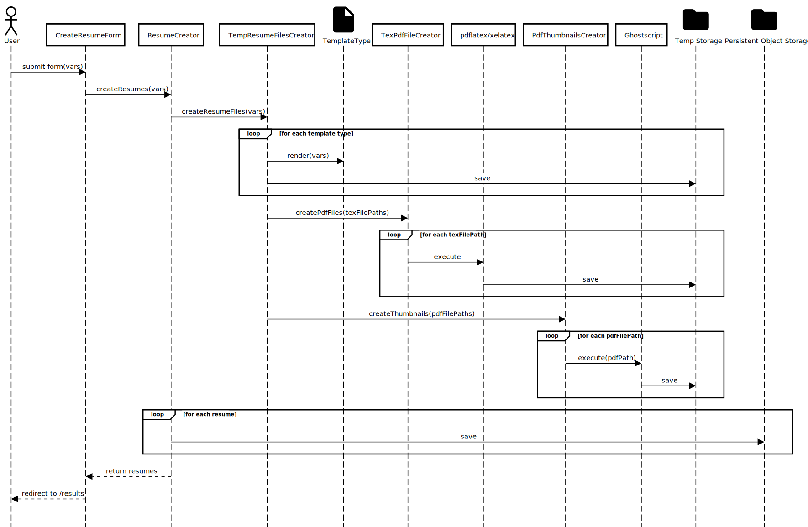

<h1 align="center">

SwiftCV
</h1>

Effortlessly generate 10+ LaTeX resumes in seconds!

---------

## About SwiftCV

[SwiftCV.io](https://swiftcv.io/) is a web application that lets users create multiple LaTeX resumes by entering their
details once, without any manual LaTeX writing required. The app includes some of the most popular LaTeX resume
templates.

## Supported resume templates

Please see https://swiftcv.io/templates (or [TemplateType.php](app/ResumeTemplates/TemplateType.php)) for a complete and
updated list of all supported resume templates.

## Design

This project is structured into different modules:

* **UI**: We use [Livewire](https://livewire.laravel.com/) to render the UI and send the details to the back-end when
  the
  user submits the resume creation form
* **TeX**: Logic to sanitize, and render the resume TeX files into a PDF using one of the two supported compilers
  (`pdflatex` or `xelatex`)
* **Resume templates**: Contains the resume templates as [Blade](https://laravel.com/docs/12.x/blade) files, their
  metadata, and rendering logic
* **PDF**: Logic to generate the image thumbnails from the resume PDF files
* **Resume creator**: A facade called by the UI and responsible for calling all the needed dependencies to generate the
  final resumes

Other modules contain logic to save files into temporary or persistent storage, to run the TeX compilers in a sandbox
and other utilities (logging etc.)

Please see below for a sequence diagram of the process to generate a set of resumes given the variables sent by the
user.

